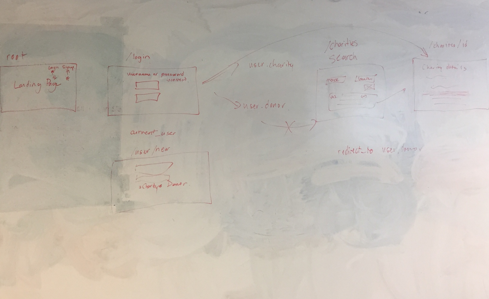

# Helping Hands

### Overview:
The WDI week 9 project was to design and build an application as a team.

The brief of the project was to:
- Build an application and a front-end that consumes it
- Create the API front-end with HTML, Javascript, & jQuery
- Craft thoughtful user stories together, as a team
- Manage team contributions and collaboration using a standard Git flow on Github
- Layout and style your front-end with clean & well-formatted CSS
- Deploy your application online

### Helping Hands
Helping Hands is an application that aims to connect people and charities online. The application allows charities to sign up and create a wishlist of items that their charity needs. The wishlist holds information such as the item's name, estimated price and a link to where it can be bought online. Donors are able to search through the list of charities in the application, view their wishlists and make a donation.

### Technologies used:
Ruby, Ruby On Rails, HTML, CSS, SASS, Bootstrap, Carrier Wave JavaScript, Jquery, Underscore.Js, Handlebars.Js, Backbone.Js, Atom (editor), debugger, iTerm, Git, Trello.com.

### System Dependencies & Configuration
Ruby 2.3.1p112

### Wireframes

Database models

Design of views

### Possible improvements:
- Create responsive form validations
- Send an email to donors on behalf of the charities to thank them for their donation
